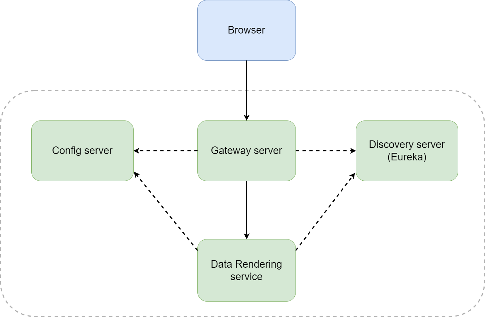

# test-gis - микросервисное приложение для рендеринга картографических данных
Java (Core, Java2D), Spring (Boot, Web, Cloud, Data R2DBC), Project Reactor, PostgreSQL, PostGIS, Maven, Docker

## О проекте
Приложение читает сущности в виде линий из базы данных и отображает их в браузерном клиенте на основе OpenLayers

Приложение содержит 4 микросервиса: 3 инфраструктурных и 1 для реализации бизнес-логики и UI 

- gateway - единая точка входа для API
- discovery - Netflix Eureka Server, выполняющий функцию Service registry
- config - централизованное хранилище конфигураций
- data-rendering - микросервис рендеринга данных с REST API и фронтенд

## Как запускать

- Скомпилировать и упаковать артефакты: 'mvn package'
- Создать и развернуть Docker-контейнеры: 'docker compose up'
- После запуска в Докере открыть страницу в браузере: http://localhost:6060/data-rendering/